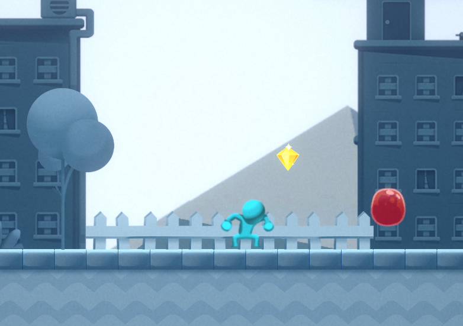
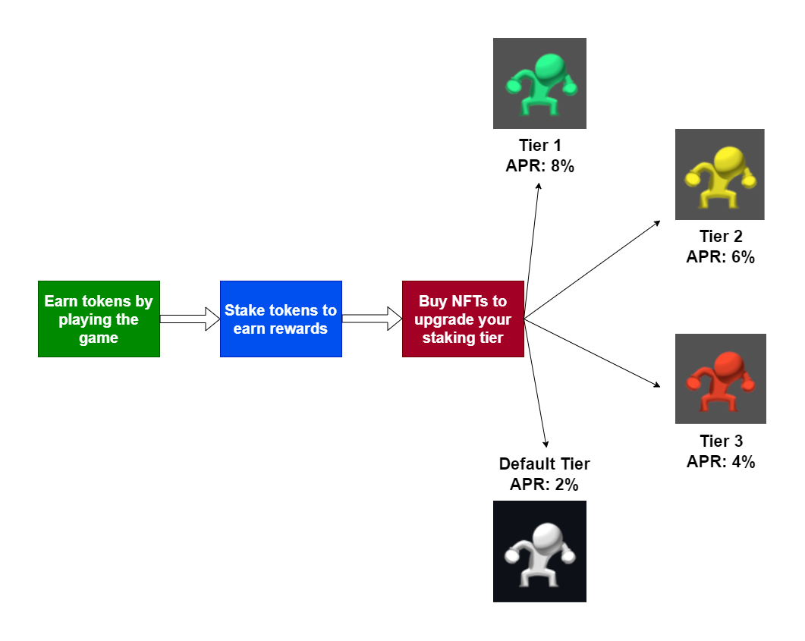

# FantomRun
A 2D platformer game which uses NFTs for characters and ERC20 tokens for the in-game currency.

 

 

 

Made with Unity version `2021.3.16f1`.

The inspiration for Fantom Run came from the increasing popularity and potential of NFTs and blockchain technology in the gaming industry. The aim was to create a unique gaming experience by combining traditional 2D platformer gameplay with the ownership and collectibility of NFTs and the use of ERC20 tokens for in-game currency.

Fantom Run is a 2D platformer game that uses NFTs for characters and ERC20 tokens for in-game currency. Players can collect and own unique NFT characters, each with its own set of skills and abilities. The in-game currency can be used to purchase upgrades and other in-game items.

 

### Fantom Run for Airdrops

The game finds application in token airdrops. Conventional airdrops have numerous downsides such as:

- Spam and security risk
- Technical complexity
- Bland nature of eligibility tasks
- Token volatility

The game can be integrated with airdrop campaigns and used as a gamified token airdrop platform. In this way, sybil resistance is possible to a satisfactory extent. It also offers a better and interactive user experience, which is beneficial for increased participation and outreach.

 

#### Staking

Fantom Run also provides provision for staking the earned tokens. Some of the benefits offered by staking tokens are:

- Encourages long-term HODLing
- Lowers token volatility
- Reduced risk of market manipulation
- Users earn passive income in the form of rewards

 

 

 

## Installation Instructions
1. Install Unity Hub.
2. Install Unity `2021.3.16f1` from the [Unity archive](https://unity.com/releases/editor/archive) and add to Unity Hub.
3. Open project in Unity Hub.
4. Build and run project.

### Contract deployments

**Fantom Testnet**

| Contract | Deployment  |
| :----- | :- |
| TokenStaker  | [`0x7CB86B01c79d26e85F5145236d11d37F80703150`](https://testnet.ftmscan.com/address/0x7CB86B01c79d26e85F5145236d11d37F80703150) |
| AirdropToken | [`0x6Fdfd3F45d62A8CAB216a9C8dFE3077CCe544d8b`](https://testnet.ftmscan.com/address/0x6Fdfd3F45d62A8CAB216a9C8dFE3077CCe544d8b)|

### Details

This project was made with a 2D platformer template from Unity and it uses Third Web's Unity SDK to connect to Fantom testnet. The in-game currency is an ERC20 token and the characters are ERC1155 NFTs which can be bought using the in-game currency.
